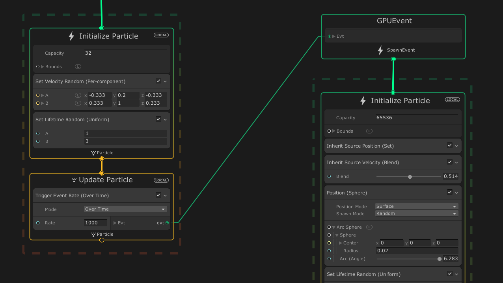

<b>Draft:</b> The content on this page is complete, but it has not been reviewed yet.

# Events

Events are the Processing Workflow inputs of a Visual Effect Graph. Through Events, a Visual Effect can :

* Start and stop spawning particles, 
* Read Attribute payloads sent from C#

Events are used in the graph as inputs for Spawn Contexts and Initialize

## Creating Events

You can Create Events using Event Contexts. These contexts have no Flow input and connect to Spawn or Initialize Contexts.

In order to Create an Event Context, right click in an empty space of the Workspace and select Create Node, then Select **Event (Context)** from the Node Creation menu.

## Default Events

Visual Effect Graphs provide two Default Events that are implicitly bound to the Start and Stop Flow Inputs of the Spawn Contexts:

* `OnPlay` for the intent *Enabling the Spawn of Particles*, is implicitly bound to the Start Flow input of any Spawn Context.
* `OnStop` for the intent of *Stopping the Spawn of Particles*, is implicitly bound to the Stop Flow input of any Spawn Context.

Connecting Event Contexts on the Start and Stop Flow inputs of a Spawn Contexts will remove the implicit binding to the `OnPlay` and `OnStop` Events

## Custom Events

Custom Events can be created inside Visual Effect Graphs using Event Contexts.

In order to create a custom event, create an event using the **Create Node** menu, then change its name in the **Event Name** field

## EventAttribute Payloads

Event Attribute payloads are attributes attached on one event. You can set these attributes in Visual Effect Graph using the **Set [Attribute] Event Attribute>** blocks in Spawn Contexts, but you can also attach them to events sent from the scene using the [Component API](ComponentAPI.md#event-attributes) .

EventAttribute Payloads are attributes that will implicitly travel through the graph from Events, through Spawn Systems, and that can be caught in Initialize Contexts using **Get Source Attribute Operators** and **Inherit [Attribute] Blocks**

## Default VisualEffect Event

The default Visual Effect Event defines the name of the event that is implicitly sent when a `Reset` is performed on a [Visual Effect](VisualEffectComponent.md) instance (this can happen at first start or any restart of the effect).

Default VisualEffect Event is defined in the [Visual Effect Graph Asset Inspector](VisualEffectGraphAsset.md) but can be overridden in any [Visual Effect Inspector](VisualEffectComponent.md) for any instance in the scene.

## GPU Events

GPU Events is an **Experimental feature** of Visual Effect Graph : It enables particle spawn based on other Particles.  You can enable this option in [Visual Effect Preferences](VisualEffectPreferences.md) .

GPU Events are Event Contexts that relies on Data sent from other Systems, for instance when a particle dies, or other conditions. The following Update blocks can send GPU Event Data:

* **Trigger Event On Die** :  Spawns N Particles on another system when a particle dies
* **Trigger Event Rate** : Spawn N Particles per second (or per distance travelled), based on a particle from a system
* **Trigger Event Always** :  Spawns N Particles every Frame.

These blocks connect to a **GPUEvent** Context. This context does not handle any blocks but instead connects to a Initialize Context of a child system.

In order to gather data from the parent particle, the child system must refer to [Source Attributes](Attributes.md) in its Initialize Context, by using **Get Source Attribute Operator**, or **Inherit Attribute Block**,as shown as in the example above : The child System inherits the source position of the particle that created it, and inherits roughly 50% of its speed.

