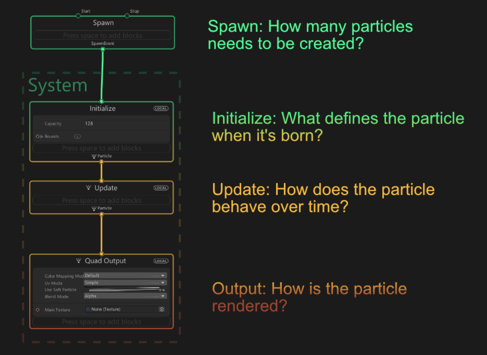

# Visual Effect Graph Logic

The Visual Effect Graph uses two distinct workflows: a _processing_ logic and a _property_ logic. Each logic follows general behavior rules. This means that the Visual Effect Graph is both vertical and horizontal. 
## Processing workflow (vertical logic)
The processing workflow links together a succession of customizable stages to define the complete system logic. This is where you can determine when the spawn, initialization, update, and rendering of the particles happen in the effect.

Processing Workflow connect together Contexts using their **Flow Slots** at the top and the bottom of the nodes.

The processing logic defines the different stages of processing of a visual effect. They are defined by large colored containers called [Contexts](Contexts.md) . Each context connects to another compatible context, which defines how the current context is used for the next stage of processing.

You can add one or many Blocks to any context. Every block is a stackable node that is in charge of one operation. You can reorder blocks to change the order in which things happen. 
## Property workflow (horizontal logic)
In the horizontal property workflow, you can enhance the processing workflow by defining from simple to highly technical math operations. This affects how the particles look and behave.

Property Workflow connect together Contexts using their **Property Slots** located in the left (inputs) and right (output) parts of the Nodes.

The Visual Effect Graph comes with a block library that is ready to use. The horizontal flow controls the render pipeline passes data to the Blocks and Contexts through a network of connected Nodes.

You can customize how particles behave by connecting horizontal nodes to a block and creating a custom expression. 
To create a custom expression from nodes, you can add nodes through the Add Node Context Menu, connect them to block properties and change their values in order to define the behavior you expect.

## Graph Elements

A Visual Effect Graph provides a workspace where you can create Graph Elements and connect them together to define effect behaviors. Visual Effect Graph comes with many different types of Graph Elements that fit into the workspace.

### Workspace

A Visual Effect Graph provides a **Workspace** where you can create Graph Elements and connect them together to define effect behaviors.

### Systems

[Systems](Systems.md) are the main components of a Visual Effect : every system defines one distinct part that the render pipeline simulates and renders alongside other systems. In the graph, systems that are defined by a succession of contexts appear as dashed outlines (see image above).

* **Spawn System** is composed of a single Spawn Context.
* **Particle System** is composed of a succession of an Initialize, then Update, then Output context. 
* **Mesh Output System** is composed of a single Mesh Output Context.

### Contexts
[Contexts](Contexts.md) are parts of the Systems that define one stage of processing. They connect vertically to define and connect systems together.

Here are the 4 common contexts in a Visual Effect Graph graph:

* **Spawn**. If active, Unity calls this every Frame, and computes the amount of particles to spawn.
* **Initialize**. Unity calls this at the “birth” of every particle, This defines the initial state of the particle. 
* **Update**. Unity calls this every frame for all particles, and uses this to perform simulations, for example Forces and Collisions.  
* **Output**. Unity calls this every frame for every particle. This determines the shape of a particle, and performs pre-render transformations.

**Note:** Some context, for example Output Mesh, do not connect to any other contexts as they do not relate to other systems.

### Blocks
[Blocks](Blocks.md) are nodes that you can stack into a Context. Every Block is in charge of one operation. For example, it can apply a force to the velocity, collide with a sphere, or set a random color.

<u>Blocks, once created can be:</u>

* Reordered in the context
* Moved to and reordered in another compatible context

<u>To configure and customize Blocks, you can:</u>

* Adjust their Properties by connecting each property’s Port to another Node with an Edge. 
* Adjusting the Settings for a property. Settings are editable values without ports that you cannot connect to other nodes.
### Operators
[Operators](Operators.md) are nodes that compose the low-level operations of the **property workflow** that you can connect to generate custom behaviors. Node networks connect to Ports that belong to Blocks or Contexts.

### Graph Common Elements

While the graph elements are different, their content and behavior tend to be the same : Graph elements share the following features and layout items :

#### Settings

Settings are Fields that the user cannot connect using Property Workflow,  they are displayed for every Graph Element:

* In the **Graph** : Between the Title and the property Container in the Graph.
* In the **Inspector** : When a node is selected, the inspector can display additional, advanced settings.

> Changing a setting's value will request a graph recompilation

#### Properties

[Properties](Properties.md) are Fields that the user can edit and connect using the Property Workflow (Horizontal) to other properties contained by other graph elements.

## Other Graph Elements

### Groups 

In addition to nodes, you can tidy up your graphs by creating groups of nodes that you can drag around and give a title in order to explain what this group does. To add a Group, select some nodes, then use the right-click context menu to select Group Nodes.

### Sticky Notes

Sticky Notes are draggable comment elements you can add to leave explanations and reminders to your co-workers or for yourself.